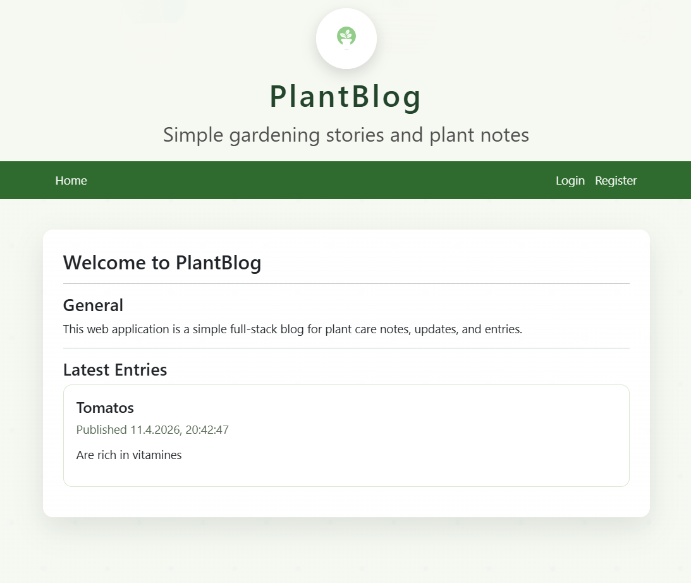
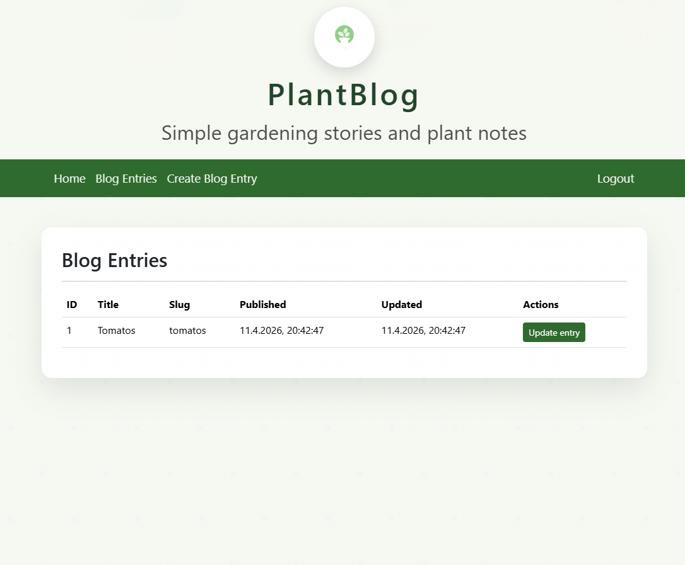
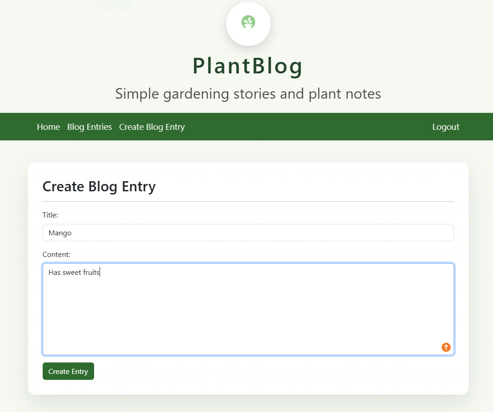
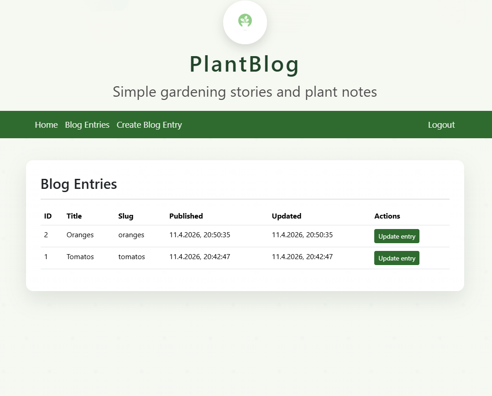

# PlantBlog

PlantBlog is a small full-stack blog application focused on plant care notes and simple content management. The project combines a React frontend, a Python Tornado backend, and a PostgreSQL database inside a Docker-based setup.

The goal of the project was to take a backend-oriented blog example and turn it into a more modern full-stack application with a separate frontend and backend. The result is a web app where users can register, log in, create blog posts, update existing posts, and see published entries on the home page.

## What The App Does

- Shows blog posts on the home page
- Supports user registration and login
- Allows authenticated users to create blog entries
- Allows authenticated users to update existing entries
- Uses a clean plant-themed design with custom branding

## Project Stack

The project is split into three main parts:

- Frontend: React is used for the user interface. It handles navigation, forms, and displaying blog content.
- Backend: Tornado is used as the server-side application. It provides routes and API endpoints for login, registration, and blog management.
- Database: PostgreSQL stores users and blog entries.

Docker is used to run the services together, which makes the project easier to start and test in a consistent way.

## How The Pieces Work Together

The browser opens the React frontend.
The React app sends requests to the Tornado backend.
The Tornado backend reads from and writes to PostgreSQL.
The backend then returns data back to the frontend, which updates the page for the user.

In short:

`React UI -> Tornado backend -> PostgreSQL database`

## Why This Project Matters

This project shows practical full-stack work instead of only frontend or only backend work. It includes:

- UI development with React
- API and server logic with Python Tornado
- database integration with PostgreSQL
- containerized setup with Docker
- branding and visual customization

It also shows the ability to understand an existing codebase, extend it, adapt the design, and make the full system run together.

## Technologies Used

- React
- JavaScript
- Python
- Tornado
- PostgreSQL
- Docker
- HTML
- CSS
- Bootstrap
